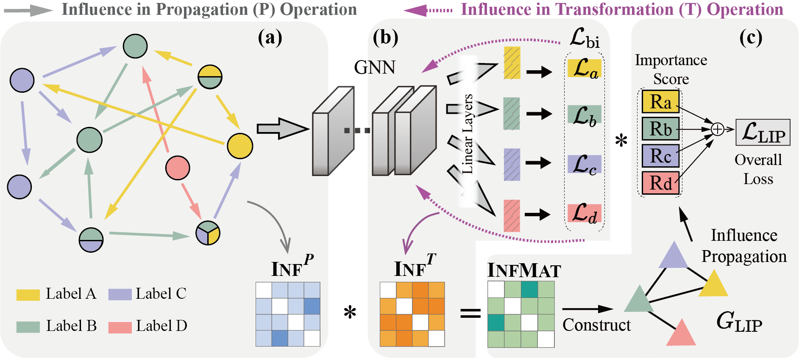

# Multi-Label Node Classification with Label Influence Propagation

## Label Influence Propagation (LIP)
This is the code for the ICLR 2025 paper: ["Multi-Label Node Classification on Graphs with Label Influence Propagation"](https://openreview.net/pdf?id=3X3LuwzZrl).


## Abstract
Graphs are a complex and versatile data structure used across various domains, with possibly multi-label nodes playing a particularly crucial role. Examples include proteins in PPI networks with multiple functions and users in social or e-commerce networks exhibiting diverse interests. Tackling multi-label node classification (MLNC) on graphs has led to the development of various approaches. Some methods leverage graph neural networks (GNNs) to exploit label co-occurrence correlations, while others incorporate label embeddings to capture label proximity. However, these approaches fail to account for the intricate influences between labels in non-Euclidean graph data.
To address this issue, we decompose the message passing process in GNNs into two operations: propagation and transformation. We then conduct a comprehensive analysis and quantification of the influence correlations between labels in each operation. 
Building on these insights, we propose a novel model, Label Influence Propagation (LIP). Specifically, we construct a label influence graph based on the integrated label correlations. Then, we propagate high-order influences through this graph, dynamically adjusting the learning process by amplifying labels with positive contributions and mitigating those with negative influence. 
Finally, our framework is evaluated on comprehensive benchmark datasets, consistently outperforming SOTA methods across various settings, demonstrating its effectiveness on MLNC tasks.

## Model Framework
<p align="center"></p>


## Directory Structure
The repository is organized into several directories and files, each serving a specific purpose:

Directories:
* ```mlncData/```: Datasets and splits used in the paper. 

* ```PR/```: The pre-computed PPR of datasets.

Files:
* ```main_lip.py```: Main code for training, validation and testing our LIP model.

* ```AllModel.py```: Code for used base models.

* ```dataset.py```: Code for preparing datasets and masks.

* ```utils.py```: Code for some used tools.

* ```ppr_cal.py```: Code for calculating PPR.

* ```genFeat.py```: Code for generate feature for blogcat dataset.

## Requirements
```
dgl-cu111==0.8.2
torch>=1.9.0 (mine==2.0.1)
scikit-learn==1.3.2
tqdm==4.66.1
argparse
```

## Usage:
- Download and decompress the files in `./mlncData/` and `./PR/` folder. For example: `tar -xzvf mlncData.tar.gz`. Prepare the datasets and splits.

<!-- - Hyper-parameter settings are put into the `configs/` folder. -->

- To run the model, use `--dataset` to specify datasets, `--run` the number of running times, `--train_ratio` the ratio of training set, and `--device`. 

- Executing the following command to run the code:     
```python
python main_lip.py --device cuda:0 --dataset dblp --model_type gcn --train_ratio 0.6 --test_ratio 0.2 --learnCoef "our" 
```

## Note:
You can also check the up-to-date version of the repository at [yifeiGit](https://github.com/Sunefei/).

## Acknowledgement:
Thanks to Paper "[Multi-label Node Classification On Graph-structured Data](https://github.com/Tianqi-py/MLGNC)" for providing the valuable multi-label data, and special thanks to its authors for the support and assistance in using the data.

## Citation
You can cite our paper by following bibtex:
```
@inproceedings{
    sun2025mlnc,
    title={Multi-Label Node Classification with Label Influence Propagation},
    author={Yifei Sun, Zemin Liu, Bryan Hooi, Yang Yang, Rizal Fathony, Jia Chen, Bingsheng He},
    booktitle={International Conference on Learning Representations},
    year={2025}
}
```

Feel free to contact [yifeisun@zju.edu.cn](mailto:yifeisun@zju.edu.cn) if you have any questions.
